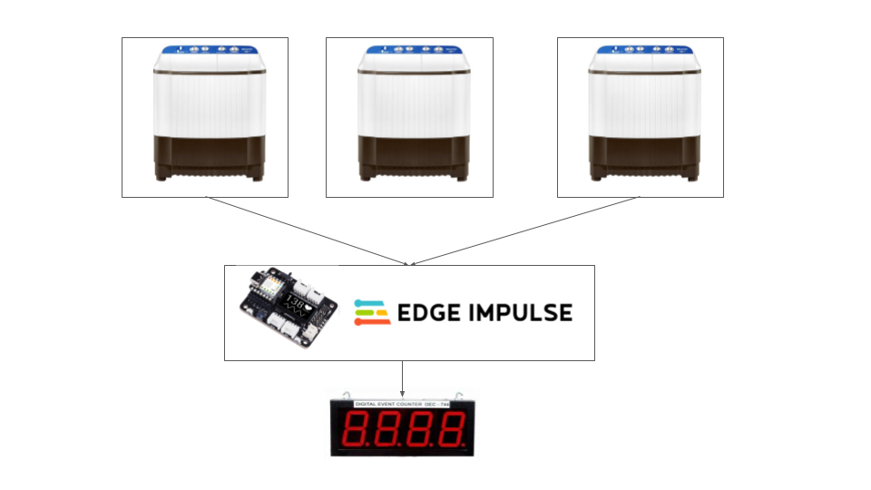

## Tinyml Washing Machine Counter.
 The repo contains the codebase for building and deployment of washing machine counter using TinyML. 

## Reference
 -[What G-Forces Do for Your Industrial Washing Machine](https://dependablelaundry.com.au/g-forces-industrial-washing-machine/)
 -[Exploring Machine Learning with the new XIAO ESP32S3](https://www.hackster.io/mjrobot/exploring-machine-learning-with-the-new-xiao-esp32s3-6463e5#toc-installing-the-xiao-esp32s3-sense-on-arduino-ide-1)